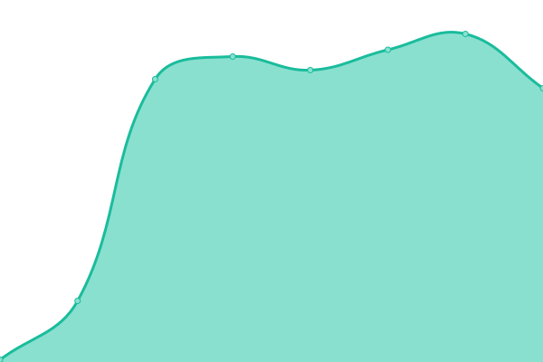

# [📈 Live Status](https://demo.upptime.js.org): <!--live status--> **🟧 Partial outage**

This repository contains the open-source uptime monitor and status page for [Marcos Soares](https://demo.upptime.js.org), powered by [Upptime](https://github.com/upptime/upptime).

With [Upptime](https://upptime.js.org), you can get your own unlimited and free uptime monitor and status page, powered entirely by a GitHub repository. We use [Issues](https://github.com/MrTorfick/upptime/issues) as incident reports, [Actions](https://github.com/MrTorfick/upptime/actions) as uptime monitors, and [Pages](https://demo.upptime.js.org) for the status page.

<!--start: status pages-->
<!-- This summary is generated by Upptime (https://github.com/upptime/upptime) -->
<!-- Do not edit this manually, your changes will be overwritten -->
<!-- prettier-ignore -->
| URL | Status | History | Response Time | Uptime |
| --- | ------ | ------- | ------------- | ------ |
|  [Nodo 1](usa1.starnode.us) | 🟥 Down | [nodo-1.yml](https://github.com/MrTorfick/upptime/commits/HEAD/history/nodo-1.yml) | 

 0ms
     
 | 

<a href="https://MrTorfick.github.io/upptime/history/nodo-1">0.00%</a>
    

|  [Nodo 2](usa2.starnode.us) | 🟥 Down | [nodo-2.yml](https://github.com/MrTorfick/upptime/commits/HEAD/history/nodo-2.yml) | 

 0ms
     
 | 

<a href="https://MrTorfick.github.io/upptime/history/nodo-2">8.44%</a>
    

|  [Nodo 3](usa3.starnode.us) | 🟩 Up | [nodo-3.yml](https://github.com/MrTorfick/upptime/commits/HEAD/history/nodo-3.yml) | 

 66ms
     
 | 

<a href="https://MrTorfick.github.io/upptime/history/nodo-3">100.00%</a>
    

|  [Nodo 4](usa4.starnode.us) | 🟩 Up | [nodo-4.yml](https://github.com/MrTorfick/upptime/commits/HEAD/history/nodo-4.yml) | 

 72ms
     
 | 

<a href="https://MrTorfick.github.io/upptime/history/nodo-4">99.01%</a>
    

<!--end: status pages-->

[**Visit our status website →**](https://demo.upptime.js.org)

## 📄 License

- Powered by: [Upptime](https://github.com/upptime/upptime)
- Code: [MIT](./LICENSE) © [Marcos Soares](https://demo.upptime.js.org)
- Data in the `./history` directory: [Open Database License](https://opendatacommons.org/licenses/odbl/1-0/)
